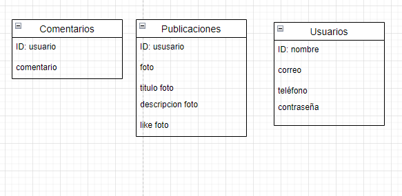

# Proyecto Fin De Grado
## ANIKU

> Juan Manuel Ramos Rodríguez

<h2><i> RED SOCIAL PARA OTAKUS

  
## 🔍 ¿De qué trata?
  
##### Mi proyecto tratará sobre una red social, en la cual para poder entrar debas registrarte o loguear.

 

##### Constará de un total de 5 páginas la cuales podremos ir viendo una vez registrado. Dichas páginas son:
- El formulario con su autentificación (primera página a la que serás dirigido).
- La página de inicio, la cual tendrá todo o casi todo el contenido.
- El perfil, donde podrás ver las fotos puntuadas sobre 5⭐.
- Una página de información.

## Base de Datos

  
  
##### En cuanto a la finalidad de esta API, pues sería el fomento de buscar parejaas dentro de este mundo de otakus. Pues hoy en día cuesta 
cada vez más buscar a tu media naranja 🍊. Así que en ANIKU tratamos de hacer esa búsqueda con un perfil real, para evitar bots y engaños.

